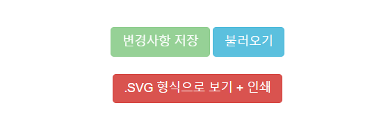

## Table Panel + Flowchart Draw by Go.js Preview in the browser

### Components used in this demo

* Frontend Server: Go.js (with jquery), bootstrap.js

### How to run

* `Clone` the repo and change directory into the repo
* `Run` Web Server in your env.
* `Access` in the browser: 
    - `http://<webserver_public_ip>:<custom_port>/project1/flowchart.html`
    - `http://<webserver_public_ip>:<custom_port>/project2/flowchart.html`
    - `http://<webserver_public_ip>:<custom_port>/project3/flowchart.html`
    - `http://<webserver_public_ip>:<custom_port>/project4/flowchart.html`
    - ...

* You can manage flowchart components with `buttons` at the **bottom of the page**:
    

  - **변경사항 저장 (Grean)**: If you have modified the flowchart components on your own, you can temporarily save the state (move component position, change text, etc.).
  - **불러오기 (SkyBlue)**: Load the flowchart state you saved temporarily.
  - **.SVG 형식으로 보기 + 인쇄 (Red)**: Outputs and prints the current status flowchart in .SVG format.